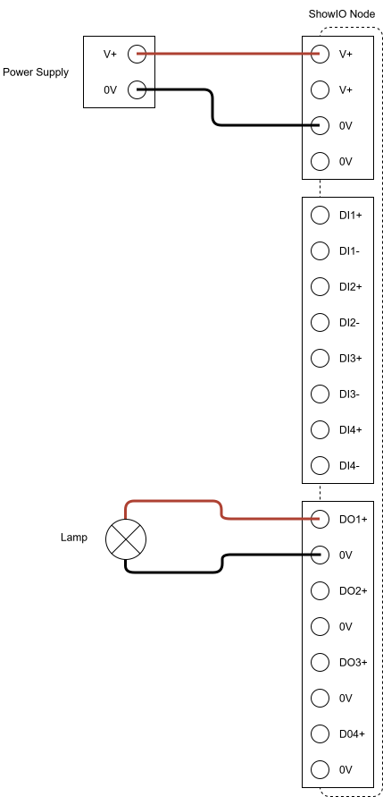

# CONNECT TO YOUR /DIGITAL/COMBO/8 OUTPUTS

Start here if you want to use your /digital/combo/8 to control an Instrument like a light, solenoid, or electromagnet with its digital output channels.

[1. You Will Need](../effects/dc8_output.md#1-you-will-need)

[2. Wiring Your Output](../effects/dc8_output.md#2-wiring-your-output)

[3. Controlling Your Output Channel](../effects/dc8_output.md#3-controlling-your-output-channel)

## 1. You Will Need

### Tools:
 - Small slotted screwdriver

### Equipment:
 - 12-24v DC Power Supply
 - Jumper Wire
 - Output - 12-24v light, magnetic lock, solenoid, electromagnet, relay—or whatever you can think of!

## 2. Wiring Your Output

!!! warning "Electrical Safety Warning"
    - Always disconnect power before making any connections or modifications to the device.

- Wire the positive leg of your output to the positive terminal of your selected digital output channel.
- Wire the negative leg of your output to the ground terminal of your selected digital output channel.
- Connect your /digital/combo/8 to power. When you press the test button for your digital output channel, the device you've connected will turn on.

### Digital Output 1 Wiring Example

## 3. Controlling Your Output Channel

Once your wiring is working, you will need to configure your show control software to send messages to your /digital/combo/8.

!!! tip

    Make sure your device is on the same subnet as your show control software before you try to send and receive messages! Refer to the [Quick Start Guide](../../products/s08dc/quick_start_guide.md#3-getting-on-the-network) for a fast method to get your computer and /digital/combo/8 talking.

 - Review the API page for [`Set Digital Output`](../../osc_api/io_commands/set_digital_output.md).
 - Configure your show control software to send either `Set Digital Output` messages to your /digital/combo/8.
 - Test your integration!
