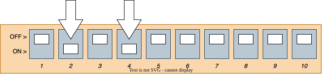
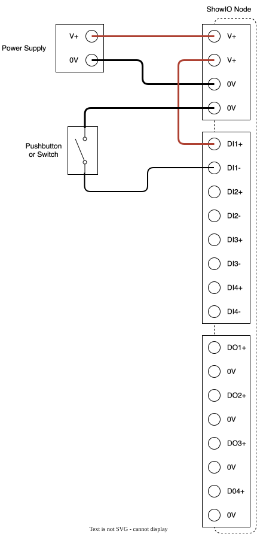

# WELCOME TO SHOWIO

We're excited to see what you can build with your new ShowIO node! At Show Technologies, we believe that we are the fastest way from idea to effect, and this guide is designed to prove it. Follow these steps and you'll get your show control software talking to the real world in no time.

[1. You Will Need](../s08dc/quick_start_guide.md#1-you-will-need)

[2. Plugging In](../s08dc/quick_start_guide.md#2-plugging-in)

[3. Getting On The Network](../s08dc/quick_start_guide.md#3-getting-on-the-network)

[4. Setting Up Digital Outputs](../s08dc/quick_start_guide.md#4-setting-up-digital-outputs)

[5. Setting Up Digital Inputs](../s08dc/quick_start_guide.md#5-setting-up-digital-inputs)

[6. Programming Your Effect](../s08dc/quick_start_guide.md#6-programming-your-effect)

## 1. You Will Need

### Tools:
 - Small slotted screwdriver

### Equipment:
 - 12-24v DC Power Supply
 - USB-C cable and/or Ethernet Cable with 8P8C/RJ45 Jacks
 - Show control computer running OSC-compatible software of your choice

## 2. Plugging In

!!! warning "Electrical Safety Warning"

    **SEE FULL WARNINGS IN YOUR DEVICE'S MANUAL**

    - Improper installation or use may result in electric shock, fire, equipment damage, or personal injury.
    - Always disconnect power before making any connections or modifications to the device.
    - Ensure proper wire gauge and insulation for all connections. Use only copper conductors rated for the application.
    - Verify correct polarity before applying power. Reverse polarity may damage the device despite built-in protection.
    - Keep the device away from water, excessive heat, and flammable materials.

You can power your ShowIO node two ways: plugging a USB-C cable into the port on the data side, or applying 12-24v DC into the IO side. USB-C power ONLY powers the ShowIO node microchip; you can configure the device and transmit OSC messages, but you can't run IO off of it. Connecting the node to DC power will both power up both the chip and the IO. 

Once you're powered up, you should see the status LED turn yellow (if you're not connected to Ethernet) or green (if you are) and you can start pushing buttons and watching lights turn on. If you're planning to use OSC over Ethernet, you should configure your device's DIP switches to use a QuickIP address or DHCP and plug it into the network switch. If you're plugged into 12-24v power, the amber LED by the power terminals will also be illuminated.

  

## 3. Getting On The Network

You can send OSC over USB, but by far the most flexible option will be getting your device on a [LAN](../../references/ethernet_guide.md#lans) with your control computer. To do this, you'll need to set your control computer and ShowIO node to the same [subnet](../../references/ethernet_guide.md#manual-addressing) and connect them with your Ethernet cable. Your /digital/combo/8 has one IP address baked in, and the option to set one more. The fastest way to get your computer and node talking is to set your computer's Ethernet adaptor IP port to an address on the `192.168.10.0/8` subnet and assigning your node a Quick-IP address. Different operating systems handle this differently; you should consult the documentation for your computer. You will also need to tell your show control program what IP address and Port to send OSC messages to over UDP. By default, ShowIO nodes listen on port `8888`. 

You can also set your ShowIO node's IP address using DHCP, or fully configure a manual IP address. Instructions for those methods are in the [manual](../../products/s08dc/manual.md#network-configuration).

!!! tip

    If you only want to connect your computer and one node, you can connect them directly with an Ethernet cable. If you have more than two devices, connect them with a [Switch.](../../references/ethernet_guide.md#lan-physical-connections)

### Setting the IP Address with Quick-IP

This configuration flow should be familiar to anyone that's set a DMX address on a light. We set the first 8 DIP switches to a binary representation of a number, 1-254.

!!! tip

    If you're not familiar with binary notation, check out this [helpful article from Laserworld](https://www.laserworld.com/en/laserworld-toolbox/dmx-address-setting.html) about setting an address using DIP switches. They even have a handy calculator!

ShowIO products ship with Quick-IP defaults `192.168.10.x` on a `255.255.255.0` subnet, where `x` is the 1-254 number set using the DIP switches. The Quick-IP address prefix, subnet, and gateway are software-configurable via OSC.

For example, to set the Quick-IP to `192.168.10.`**10**, you would set the second and fourth DIP switches to get the binary number `0000 1010`, or decimal 10.

##### Quick-IP Example

Alice has (3) ShowIO Nodes that she wants to connect to a network. She sets her laptop to `192.168.10.10` with a subnet mask of `255.255.255.0` and a default gateway of `192.168.10.1`. She sets the DIP switches on her three ShowIO Nodes to `30`, `31`, and `32`. She plugs all her devices into a network switch, and the network looks like:

| Device | IP Address |
| --- | --- |
| Alice's Laptop | 192.168.10.10 |
| Node #1 | 192.168.10.30 |
| Node #2 | 192.168.10.31 |
| Node #3 | 192.168.10.32 |

Now Alice can send messages from her laptop to all three nodes!

## 4. Setting Up Digital Outputs

If your effect involves an Instrument like a solenoid, electromagnet, light, or other 12-24v load that you want to turn on or off, you'll want to hook it up to one of the digital output channels. Simply wire the positive leg of your effect to the positive terminal, and the negative to the negative. You can verify that your wiring is working by pressing the troubleshooting button associated with that digital output. Send your device the [Set Digital Output](../../osc_api/io_commands/set_digital_output.md) command to turn the channel on or off.

## 5. Setting Up Digital Inputs

If you need to get an input from an Instrument like a switch or digital sensor, you will wire it to a digital input channel. Digital Inputs are not powered; you will wire one terminal of the input channel to the power terminal, and connect the other input terminal through your switch or sensor. To get data from your digital input, you can send a [Subscribe Me](../../osc_api/configuration_commands/subscribe_me.md) from your show control software to receive a [Report](../../osc_api/overview.md#message-types) whenever a digital input changes state. By default, your device will send reports to Port `9999`. You can change this to match your show control's receiving port by sending a [Set Response Port](../../osc_api/configuration_commands/set_response_port.md) command. You can also send a [Get Digital Input](../../osc_api/io_commands/get_digital_output.md) command to poll an output's state at any time.

##### Channel Wiring Example

## 6. Programming Your Effect

And that's it! You are reading an input and controlling an output from your /digital/combo/8. There are guides to integrate various show control softwares with your ShowIO node in the [cookbook](../../cookbook/overview.md). Now you can use your show control software to integrate your physical effects, and cue the real world!